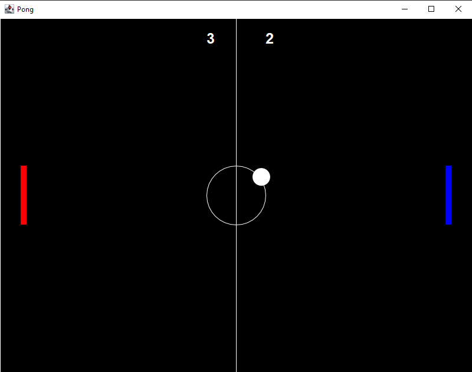

[![Contributors][contributors-shield]][contributors-url]
[![Forks][forks-shield]][forks-url]
[![Stargazers][stars-shield]][stars-url]
[![Issues][issues-shield]][issues-url]
[![MIT License][license-shield]][license-url]
[![LinkedIn][linkedin-shield]][linkedin-url]

 

  

  <h2 align="center">SwingPong</h3>

<!-- ABOUT THE PROJECT -->
## About The Project
This project contains a simple implementation of the classic Pong game. It was written by [Kacper Leśniara](https://github.com/calychas) and [Szymon Woźniak](https://github.com/simonusher), as our first private project during our first semester of bachelor's studies. Due to that it definitely contains multiple bugs and code flaws/smells. It is **definitely discontinued**. Feel free to use it in any way you want though.

### Built With

* Java,
* Swing.

<!-- LICENSE -->
## License

Distributed under the MIT License. See `LICENSE` for more information.

<!-- CONTACT -->
## Contact

Szymon Woźniak - swozniak6@gmail.com

Project Link: [https://github.com/TeamMoniuszki/SwingPong](https://github.com/TeamMoniuszki/SwingPong)

[contributors-shield]: https://img.shields.io/github/contributors/TeamMoniuszki/SwingPong.svg?style=for-the-badge
[contributors-url]: https://github.com/TeamMoniuszki/SwingPong/graphs/contributors
[forks-shield]: https://img.shields.io/github/forks/TeamMoniuszki/SwingPong.svg?style=for-the-badge
[forks-url]: https://github.com/TeamMoniuszki/SwingPong/network/members
[stars-shield]: https://img.shields.io/github/stars/TeamMoniuszki/SwingPong.svg?style=for-the-badge
[stars-url]: https://github.com/TeamMoniuszki/SwingPong/stargazers
[issues-shield]: https://img.shields.io/github/issues/TeamMoniuszki/SwingPong.svg?style=for-the-badge
[issues-url]: https://github.com/TeamMoniuszki/SwingPong/issues
[license-shield]: https://img.shields.io/github/license/TeamMoniuszki/SwingPong.svg?style=for-the-badge
[license-url]: https://github.com/TeamMoniuszki/SwingPong/blob/master/LICENSE.txt
[linkedin-shield]: https://img.shields.io/badge/-LinkedIn-black.svg?style=for-the-badge&logo=linkedin&colorB=555
[linkedin-url]: https://www.linkedin.com/in/szymon-wo%C5%BAniak-00505318a/
